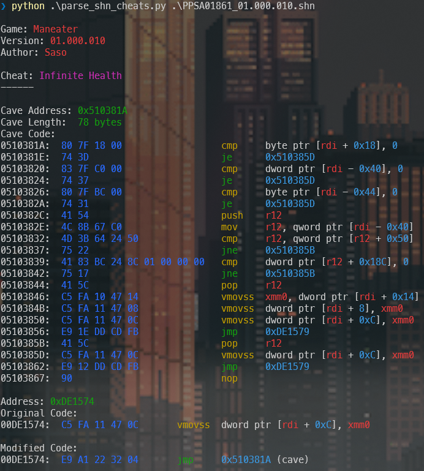

# PS4/PS5 .shn Cheat Parser [v0.1]

A Python script to parse `.shn` XML files containing PS4/PS5 cheats, and print them neatly.



It uses [Capstone](https://pypi.org/project/capstone/) and [Colorama](https://pypi.org/project/colorama/).

## Requirements

```bash
pip install colorama capstone
```

## Usage

```bash
python parse_shn_cheats.py <cheat.shn>
